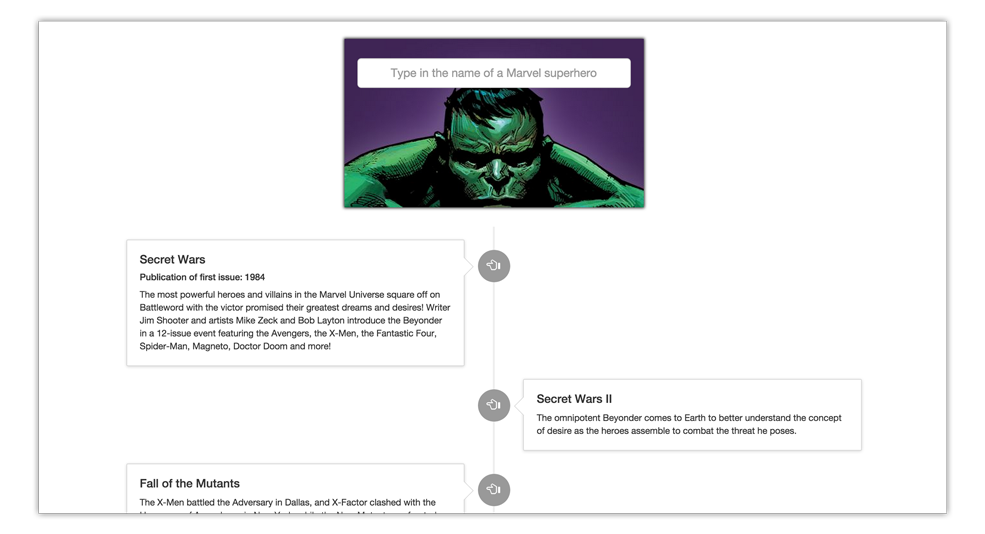

# Marvel Timelines JS

## Project

A simple front-end JavaScript application that interacts with the Marvel API. It returns, in descending order by date, a timeline of major events in the Marvel universe in which a particular superhero appears. The user can then see an image of the first published issue of each event.

## Technologies

* HTML5/CSS3
* JavaScript
* Bootstrap
* Marvel API

## User Stories

https://drive.google.com/file/d/0B9Crbz5DCG-uSkdBalc4UWp5d3M/view?usp=sharing

## Unsolved Problems or Major Hurdles

I originally began the project more ambitiously, investigating the use of both Meteor and D3, but eventually decided to pivot to front-end only because of the time constraints. I also begin to see it as targeted more to comic book collectors, rather than to just the casual fan. One of my main hurdles was the use of public, private, and hashed API keys to connect with the Marvel API. It turns out to be impossible to safeguard a private key without using a backend.
